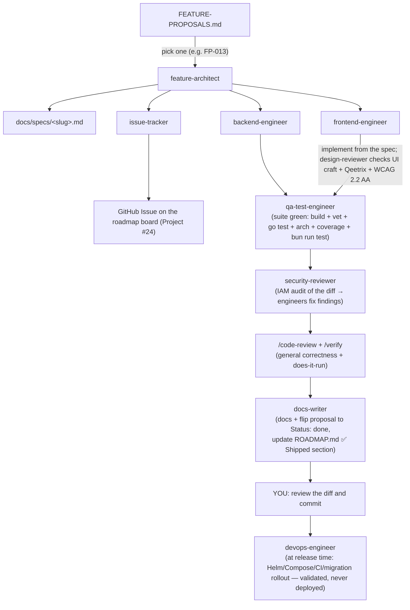

# Qeet ID — feature delivery pipeline

How a competitive proposal becomes shipped, tested, security-reviewed code. The
**product-manager** agent finds gaps; this pipeline builds them.

## The agents

| Stage | Agent | Output | Model |
|---|---|---|---|
| 0. Research | `product-manager` | `qeet-files/qeet-id/FEATURE-PROPOSALS.md` | sonnet |
| 1. Spec | `feature-architect` | `docs/specs/<slug>.md` | opus |
| 1.5. Track | `issue-tracker` | GitHub Issue on the roadmap board (Project #24) — labels/fields/milestone; also reconciles the board vs code | sonnet |
| 2a. Backend | `backend-engineer` | Go domain pkg + migration + OpenAPI + wiring | sonnet |
| 2b. Frontend | `frontend-engineer` | React app(s) + SDK updates | sonnet |
| 2b+. UI review | `design-reviewer` | enterprise-UI findings: Qeetrix fidelity + states + responsive/dark + WCAG 2.2 AA (read-only; verdict) | sonnet |
| 3. Tests | `qa-test-engineer` | unit + integration + API + Vitest | sonnet |
| 4. Security | `security-reviewer` | findings report (read-only) | opus |
| 5. Docs / loop | `docs-writer` | docs + proposal marked `done` | sonnet |
| 6. Deploy (when shipping) | `devops-engineer` | Helm/Compose/CI/migration-rollout, validated | sonnet |

**Reuse (don't duplicate):** `/code-review` (general correctness), `/verify` (run it & confirm it works), `/simplify` (cleanup), `code-architect` (general design), `/security-review` (generic pass; `security-reviewer` goes deeper on IAM).

## The flow

## How to run it
You (or this Claude session) orchestrate by invoking each subagent in turn — there's no nested auto-orchestrator (subagents don't deeply nest). For example, in a session opened in `qeet-id/`:

> "Use the **feature-architect** agent to spec FP-013, then the **backend-engineer** to implement it, then **qa-test-engineer**, then **security-reviewer**."

Or step by step, reviewing each hand-off. Run one feature at a time.

## Definition of done
- `go build ./... && go vet ./... && go test ./...` green
- `go test -count=1 ./tests/architecture/...` green (arch boundaries)
- OpenAPI coverage test green (`api/openapi/` documents every route)
- `bun run typecheck && bun run lint && bun run test` green (if frontend touched)
- `make test-integration` green (if Docker available)
- security-reviewer findings resolved (no open Critical/High)
- `docs/` updated; proposal `Status: done`; `ROADMAP.md` (✅ Shipped section) updated
- **You** have reviewed the diff — then commit (agents don't commit/push)
