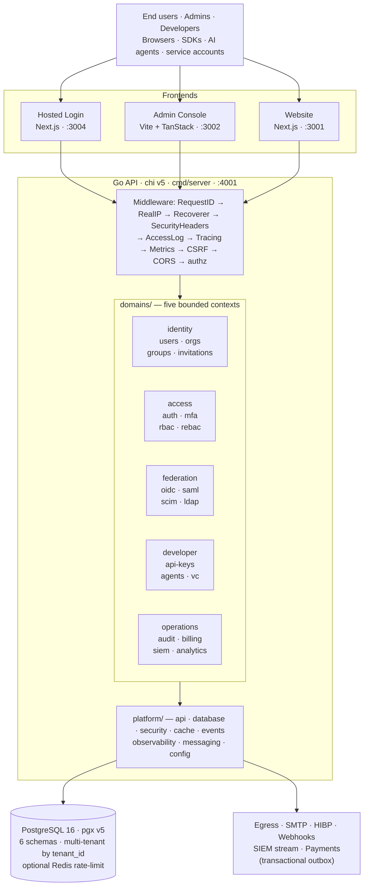

<div align="center">

# 🔐 Qeet ID

### Passkeys-first identity platform — the open-source Auth0 / Okta alternative

*Developer-first · Enterprise-ready · Self-hostable · India-native*

<br>

[](./.github/workflows/ci.yml)
[](./go.mod)
[](./api/openapi/)
[](./LICENSE)

**[🚀 Quickstart](#-quickstart)** · **[🏗 Architecture](#-architecture)** · **[🧩 Features](#-features)** · **[📦 SDKs](#-sdks)** · **[🚢 Deploy](#-deployment)** · **[📚 Docs](#-documentation)**

</div>

---

<div align="center">

| 🏗 Single deployable | 🔌 ~190 API routes | 🖥 3 React frontends | 📦 6 SDKs | 🗄 65 migrations |
|:---:|:---:|:---:|:---:|:---:|
| Go modular monolith | 5 OpenAPI 3.1 specs | Admin · Login · Website | TS (browser+node) · React · Next · Go · Py | 6 Postgres schemas |

</div>

> **Status — pre-1.0, feature-complete for the July 2026 GA.** Every capability below has working Go code (no stubs). Remaining work is external-ops hardening (KMS BYOK, conformance, deliverability, pentest) + i18n/a11y polish.

---

## ✨ Why Qeet ID

|  |  |
|:--|:--|
| 🔑 **Passkeys-first** | Native WebAuthn — passwordless, magic links, OTP, social |
| 🏢 **Enterprise SSO** | SAML 2.0 **SP *and* IdP**, SCIM 2.0, LDAP / Active Directory |
| 🛡️ **Fine-grained authz** | RBAC + ABAC + **ReBAC** (Zanzibar-style `/check`) |
| 🤖 **AI-agent identity** | MCP introspection, token exchange (RFC 8693), W3C Verifiable Credentials |
| 📜 **Tamper-evident audit** | SHA-256 hash-chained log with a `/verify` integrity walk |
| 💳 **Billing built-in** | Multi-currency, Stripe (global) + Razorpay (India) |
| 🌍 **Open & self-hostable** | MIT-licensed, single Go binary — no vendor lock-in |
| 🧰 **Batteries included** | 3 frontends + 5 first-party SDKs + hosted login |

<details>
<summary><b>📊 Full comparison vs Auth0 · Okta · Clerk · Supabase · better-auth</b></summary>

<br>

| Capability | **Qeet ID** | Auth0 | Okta | Clerk | Supabase | better-auth |
|:---|:---:|:---:|:---:|:---:|:---:|:---:|
| Open source (MIT) | ✅ | ❌ | ❌ | ❌ | ✅ | ✅ |
| Fully self-hostable | ✅ | ❌ | ❌ | ❌ | ✅ | ✅ |
| Passkeys / WebAuthn | ✅ Native | 🟡 Add-on | 🟡 Add-on | ✅ | ✅ | ✅ |
| SAML 2.0 SP **and** IdP | ✅ Both | 🟡 SP only | ✅ | 🟡 Ent. | ❌ | ❌ |
| SCIM 2.0 provisioning | ✅ | ✅ | ✅ | ❌ | ❌ | ❌ |
| ReBAC (Zanzibar-style) | ✅ | ❌ | 🟡 OPA | ❌ | ❌ | ❌ |
| AI-agent identity (MCP) | ✅ | ❌ | ❌ | ❌ | ❌ | ❌ |
| Verifiable Credentials | ✅ | ❌ | ❌ | ❌ | ❌ | ❌ |
| Hash-chained audit | ✅ | ❌ | ❌ | ❌ | ❌ | ❌ |
| SIEM streaming | ✅ | 🟡 Export | ✅ | ❌ | ❌ | ❌ |
| Multi-currency billing | ✅ | ❌ | ❌ | ❌ | ❌ | ❌ |

</details>

---

## 🏗 Architecture

A **single deployable** Go module — five bounded contexts over shared infrastructure, with boundaries enforced by build-time fitness tests, not convention.



**Engineering invariants** — the things that make it enterprise-grade:

- 🧱 **Modular-monolith boundaries** — `platform/*` never imports `domains/*` (arch test rules R1/R2 fail CI)
- 📘 **100% API documentation** — `chi.Walk` coverage gate; an undocumented route fails CI
- 🏘️ **Multi-tenant isolation** — every table carries `tenant_id`; 6 schemas, no cross-schema joins
- 📤 **Reliable eventing** — transactional outbox (business + audit + event in one tx) + DLQ
- 🔏 **Asymmetric tokens** — ES256 / ECDSA P-256, JWKS-published, `kid` = RFC 7638 thumbprint

Deep dives: [`docs/architecture/`](./docs/architecture/) · Decision records: [`docs/adr/`](./docs/adr/)

---

## 🧩 Features

> **The full v1 surface is built and working** — every endpoint implemented (no stubs), every ✅ admin screen wired to a live API, marketing site + hosted login complete.

- 🔑 **Authentication** — email+password (Argon2id), passkeys/WebAuthn, magic links, email/SMS OTP, social, MFA (TOTP + recovery codes), HIBP breach check
- 🏢 **Enterprise SSO** — OIDC/OAuth 2.0 provider, Device grant (RFC 8628), Token Exchange (RFC 8693), SAML SP+IdP, SCIM 2.0, LDAP/AD
- 🛡️ **Authorization** — RBAC, ABAC policies, ReBAC (Zanzibar relation tuples + recursive `/check`), IP allow/deny, Auth Hooks
- 🤖 **Developer & AI-agent** — scoped API keys, M2M service accounts, secrets + Token Vault (AES-256-GCM), HMAC webhooks, AI-agent identity, MCP introspection, W3C Verifiable Credentials
- 👥 **Identity & workspace** — multi-tenant orgs, users/groups/invitations, domain verification, per-tenant branding + email templates
- 📜 **Compliance & billing** — hash-chained audit, GDPR erasure + export, data retention, SIEM streaming, multi-currency billing (Stripe + Razorpay)

<details>
<summary><b>📋 See every feature, with status & notes</b></summary>

<br>

**🔑 Authentication & sessions** — email+password (Argon2id, lockout, enumeration-safe) · passkeys/WebAuthn (FIDO2, cross-device), **including passkey-first signup** (a passkey founds the account directly — no password required) · magic links · email/SMS OTP · TOTP + 8 recovery codes · **adaptive MFA** (bot-score risk engine plus two additive, off-by-default signals: impossible travel and device reputation) · session mgmt (refresh rotation + theft detection, a 10-minute access-token TTL, refresh now also rejects a suspended/deleted user) · **CAEP/SSF-shaped revocation signals** (`session.revoked`, `token.claims_change`) riding the existing webhook dispatcher · HIBP breach detection · password reset.

**🏢 Enterprise SSO & provisioning** — OIDC/OAuth 2.0 provider (discovery, JWKS, PKCE, `/userinfo`, refresh, revoke, introspect, logout) · Device Authorization Grant (RFC 8628) · Token Exchange (RFC 8693, downscope + delegation) · CIBA backchannel auth · SAML 2.0 SP **and** IdP · SCIM 2.0 (users + groups + PatchOp) · LDAP/AD · social login · account linking · SSO test-connection · **self-serve Admin Portal** (a capability-scoped, time-limited link lets a tenant's *own* IT admin configure SAML/SCIM directly — no Qeet ID account, no console login).

**🛡️ Authorization** — RBAC (`?explain=true` grant-path trace) · per-tenant policy (IP allow/deny CIDR, password/login-method rules — not a general ABAC engine) · **ReBAC** (`relation_tuples`, recursive `/check` with cycle guard, **`?explain=true` grant-path trace**) · Auth Hooks/Actions (post-login allow/deny **+ custom-claim injection**, HMAC-signed).

**🤖 Developer & AI-agent platform** — scoped API keys (`qk_`, hashed, audited) · service accounts (`client_credentials`) · secrets vault (AES-256-GCM, scoped `vault:<name>`) · **Token Vault** (per-tenant encrypted 3rd-party OAuth tokens — Slack/GitHub/Google/custom — with auto-refresh; callers never see the raw refresh token; API-only, no console UI) · HMAC webhooks (backoff retry with a dead-letter give-up state after `maxDeliveryAttempts`) · **Agent Governance** — one named console section (`/developer/agents`), not scattered settings: ephemeral scoped revocable tokens (`actor_type=agent`), tenant-wide kill-switch, lifecycle state machine, a sponsor-transfer tool (search-select, previews affected count), and a Shadow-AI review queue (unreviewed OIDC clients holding machine grants) · **Agent-as-Principal** (`actor_types_supported` discovery metadata) · **CIBA** backchannel auth (poll mode, API-only) · **AuthZEN PDP/PEP** (`POST /tenants/{id}/access/v1/evaluation`, standard facade over RBAC/ReBAC) · **MCP introspection** · **token delegation** (RFC 8693 `act` claim) · **W3C JWT-VC** (issue/verify/revoke) · analytics · SIEM streaming.

**👥 Identity & workspace** — multi-tenant orgs (isolated, branded, custom domains) · users (CRUD, sessions, recycle bin, bulk CSV/NDJSON import, **IdP migration import from Auth0/Cognito/Azure AD B2C**) · nested groups (SCIM sync) · invitations · domain verification (DNS TXT) · per-tenant email templates · org switcher + branding preview.

**📜 Compliance & billing** — SHA-256 hash-chained audit (`/verify`) · **audit intelligence** (behavioral-baseline anomaly detection over the audit log — first-time action types, unusual hours, new IPs — with per-tenant tuning) · GDPR erasure + grace-period purge · GDPR data export (async, profile/sessions/passkeys/roles/MFA status) · retention auto-purge · SOC 2 / ISO 27001 compliance screens (static templates, not generated evidence) · multi-currency billing (ISO-4217) · card payments via Stripe (global) + Razorpay (India), webhook-verified (env-gated).

</details>

<details>
<summary><b>⏳ Planned / remaining</b></summary>

<br>

**🛠 Product roadmap**
- i18n catalogs + WCAG 2.2 AA across remaining legacy screens
- Ops hardening (not code): AWS KMS BYOK, OpenID conformance run, deliverability (SPF/DKIM/DMARC), RDS PITR, external pentest

**🤖 AI-agent identity & governance** *(surfaced by the competitive-research `product-manager` agent — 🟠 high · 🟡 medium · 🟢 later; agent lifecycle/sponsor model, Agent-as-Principal, Shadow-AI discovery, CIBA, AuthZEN PDP/PEP, and CAEP/SSF-shaped revocation signals already ship)*
- 🟢 **Device-bound agent credentials** — TPM/enclave-attested keys (RFC 8705 mTLS)

**🧰 Developer experience**
- 🟡 `qeetid` management CLI (`--json` for CI/agents) · 🟡 FGA Permissions Index (low-latency RAG authz) · 🟢 Rust SDK

All planned packages/surfaces are tracked in [ROADMAP.md](./ROADMAP.md).

</details>

---

## 🚀 Quickstart

**Prerequisites:** Go ≥ 1.25 · Node ≥ 24 (via nvm) · pnpm ≥ 9.15.4 · Docker · [golang-migrate CLI](https://github.com/golang-migrate/migrate/tree/master/cmd/migrate)

```bash
# 1. Clone
git clone https://github.com/qeetgroup/qeet-id && cd qeet-id

# 2. Install dependencies
go mod download
nvm use 24 && pnpm install

# 3. Copy env files
cp .env.example .env                                      # backend — DB_URL has a working local default
cp apps/console/.env.example apps/console/.env            # admin frontend
cp apps/login/.env.example apps/login/.env.local          # hosted login
cp apps/website/.env.example apps/website/.env.local      # marketing site

# 4. Start Postgres + apply migrations
make db-up migrate-up

# 5. Seed demo data (optional)
make seed

# 6. Start the backend
make dev
```

**Frontend apps — each in its own terminal:**

| Command | App | URL |
|:---|:---|:---|
| `pnpm --filter @qeet-id/console dev` | Admin console | <http://localhost:3002> |
| `pnpm --filter @qeet-id/login dev` | Hosted login | <http://localhost:3004> |
| `pnpm --filter @qeet-id/web dev` | Marketing site | <http://localhost:3001> |

Sanity check: `curl localhost:4001/healthz` · Demo login: **`saibabu@qeet.in`** / **`Password123!`**

---

## 📦 SDKs

Six first-party SDKs authenticate via `Authorization: ApiKey` + ES256/JWKS verification.

| SDK | Install |
|:---|:---|
| TypeScript (browser) | `npm install @qeet-id/client` |
| TypeScript (server/node) | `npm install @qeet-id/node` |
| React (`<SignIn/>`, `<UserButton/>`, `<OrgSwitcher/>`, `<SignUp/>`, `<CreateOrganization/>`, `<OrganizationProfile/>`, `<UserProfile/>` + hooks) | `npm install @qeet-id/react` |
| Next.js (sealed-cookie sessions) | `npm install @qeet-id/nextjs` |
| Go | `go get github.com/qeetgroup/qeet-id/sdk/go` |
| Python | `pip install qeetid` |

```ts
import { useSession, UserButton } from '@qeet-id/react';

export function Navbar() {
  const { user } = useSession();
  return <UserButton />;   // sign-in / sign-out / profile, zero config
}
```

---

## 🚢 Deployment

Ships as a **distroless nonroot** container; migrations run as a separate one-shot image **before** the app starts. Both build with the repo root as context.

```
EC2 instance  ←  Caddy (TLS)  ←  qeet-id app  ←  AWS RDS (Postgres 16)
                                  Redis (rate-limit)
```

Release image is cosign-signed with SBOM + provenance: `ghcr.io/qeetgroup/qeet-id`. Migrations run automatically on startup — no separate image needed.

> Kubernetes (Helm), Terraform, and multi-env staging configs are available in git history and tracked in [ROADMAP.md](./ROADMAP.md) for when you're ready to scale.

---

## 🧪 Testing & quality

Every push runs the full gate in [CI](./.github/workflows/ci.yml); the same checks are reproducible locally.

```bash
make test                            # backend unit + arch-fitness tests (go test ./...)
go test -tags integration ./tests/integration/...   # real Postgres via testcontainers (needs Docker)
make lint                            # go vet — CI additionally runs golangci-lint
pnpm lint && pnpm typecheck && pnpm build && pnpm test   # frontend (Turbo, all 3 apps)
```

CI gates include **architecture fitness (R1/R2)**, **100% OpenAPI coverage**, `golangci-lint`, `govulncheck`, and `gitleaks`. Coverage-floor enforcement, Spectral spec-lint, and Postman/Newman contract tests are not wired yet — tracked in [ROADMAP.md](./ROADMAP.md). [`tests/performance/`](./tests/performance/) has k6 load scripts (auth, user CRUD, RBAC/ReBAC `/check`) for manual local runs — not wired into CI, no published numbers yet.

---

## 🛠 Tech stack

- **Backend** — Go 1.25 · chi v5 · pgx v5 (hand-written SQL, no ORM — [ADR-0003](./docs/adr/0003-postgresql-hand-written-sql.md)) · ES256 JWTs + JWKS rotation · Argon2id · AES-256-GCM vault · transactional outbox + DLQ
- **Frontend** — React 19 · admin on Vite + TanStack · web/login on Next.js 16 · Tailwind 4 + the shared [`@qeetrix/*`](../qeetrix/) design system · pnpm + Turborepo
- **Data** — PostgreSQL (`tenant`/`user`/`auth`/`rbac`/`audit`/`platform` schemas), multi-tenant by `tenant_id` · optional Redis for cross-replica rate limiting

---

## 📚 Documentation

| Topic | Where |
|:---|:---|
| 🏗 Architecture deep-dives + ADRs | [docs/architecture/](./docs/architecture/) · [docs/adr/](./docs/adr/) |
| 🔒 Security & compliance | [docs/security/](./docs/security/) · [docs/compliance/](./docs/compliance/) |
| 🚀 Onboarding & dev workflow | [docs/onboarding/](./docs/onboarding/) |
| 🔌 API spec + Postman | [api/openapi/](./api/openapi/) · [api/postman/](./api/postman/) |
| 🤖 For AI assistants | [CLAUDE.md](./CLAUDE.md) — layout, commands, gotchas |
| 📖 End-user docs | [docs.qeet.in](https://docs.qeet.in) |

---

## 🤝 Contributing · 🔒 Security · 📄 License

Contributions welcome — see [CONTRIBUTING.md](./CONTRIBUTING.md) and the issue templates in [.github/](./.github/ISSUE_TEMPLATE/).
Found a vulnerability? **Don't open a public issue** — follow [SECURITY.md](./SECURITY.md). CI runs `gitleaks` on every push.
Licensed under [MIT](./LICENSE).
