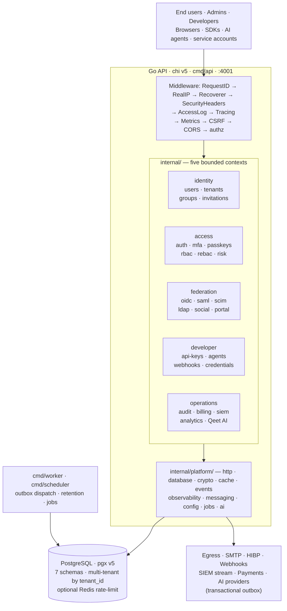
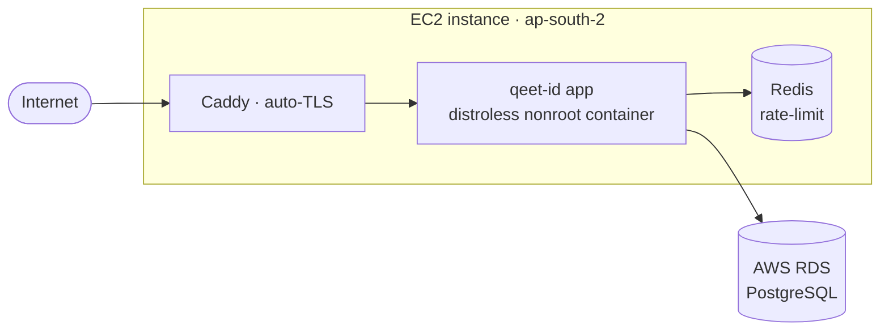

<div align="center">

# 🔐 Qeet ID

### Passkeys-first identity platform — the open-source Auth0 / Okta alternative

*Developer-first · Enterprise-ready · Self-hostable · India-native*

<br>

[](./.github/workflows/ci.yml)
[](./go.mod)
[](./api/openapi/)
[](./LICENSE)

**[🚀 Quickstart](#-quickstart)** · **[🏗 Architecture](#-architecture)** · **[🗂 Layout](#-repository-layout)** · **[🧩 Features](#-features)** · **[📦 SDKs](#-sdks)** · **[🚢 Deploy](#-deployment)** · **[📚 Docs](#-documentation)**

</div>

---

<div align="center">

| 🏗 Single deployable | 🔌 260+ API endpoints | 🧩 5 bounded contexts | 📦 3 SDKs | 🗄 95 migrations |
|:---:|:---:|:---:|:---:|:---:|
| Go modular monolith | 5 OpenAPI 3.1 specs | access · identity · federation · developer · operations | TS (Node) · React · Go | 7 Postgres schemas |

</div>

> **Status — pre-1.0, feature-complete and on the GA track.** Every capability below is backed by working Go code (no stubs). No versioned release has been tagged yet; the first `1.0.0` is cut at public GA. Remaining work is external-ops hardening (KMS BYOK, OpenID conformance, deliverability, pentest) plus i18n / a11y polish. **[ROADMAP.md](./ROADMAP.md) is the single source of truth** for shipped-vs-planned status; **[CHANGELOG.md](./CHANGELOG.md)** records what lands per release.

---

## ✨ Why Qeet ID

|  |  |
|:--|:--|
| 🔑 **Passkeys-first** | Native WebAuthn — passwordless, magic links, OTP, social |
| 🏢 **Enterprise SSO** | SAML 2.0 **SP *and* IdP**, SCIM 2.0, LDAP / Active Directory |
| 🛡️ **Fine-grained authz** | RBAC + ABAC + **ReBAC** (Zanzibar-style `/check`) |
| 🤖 **AI-native** | Agent identity (MCP, RFC 8693 token exchange, W3C VCs) **+ an in-product BYOK AI assistant** |
| 📜 **Tamper-evident audit** | SHA-256 hash-chained log with a `/verify` integrity walk |
| 💳 **Billing built-in** | Multi-currency, Stripe (global) + Razorpay (India), plan entitlements |
| 🌍 **Open & self-hostable** | MIT-licensed, single Go binary — no vendor lock-in |
| 🧰 **Batteries included** | 3 first-party SDKs (TS · React · Go) + OpenAPI 3.1 specs + Postman collection |

<details>
<summary><b>📊 Full comparison vs Auth0 · Okta · Clerk · Supabase · better-auth</b></summary>

<br>

| Capability | **Qeet ID** | Auth0 | Okta | Clerk | Supabase | better-auth |
|:---|:---:|:---:|:---:|:---:|:---:|:---:|
| Open source (MIT) | ✅ | ❌ | ❌ | ❌ | ✅ | ✅ |
| Fully self-hostable | ✅ | ❌ | ❌ | ❌ | ✅ | ✅ |
| Passkeys / WebAuthn | ✅ Native | 🟡 Add-on | 🟡 Add-on | ✅ | ✅ | ✅ |
| SAML 2.0 SP **and** IdP | ✅ Both | 🟡 SP only | ✅ | 🟡 Ent. | ❌ | ❌ |
| SCIM 2.0 provisioning | ✅ | ✅ | ✅ | ❌ | ❌ | ❌ |
| ReBAC (Zanzibar-style) | ✅ | ❌ | 🟡 OPA | ❌ | ❌ | ❌ |
| AI-agent identity (MCP) | ✅ | ❌ | ❌ | ❌ | ❌ | ❌ |
| Verifiable Credentials | ✅ | ❌ | ❌ | ❌ | ❌ | ❌ |
| Hash-chained audit | ✅ | ❌ | ❌ | ❌ | ❌ | ❌ |
| SIEM streaming | ✅ | 🟡 Export | ✅ | ❌ | ❌ | ❌ |
| Multi-currency billing | ✅ | ❌ | ❌ | ❌ | ❌ | ❌ |

</details>

---

## 🏗 Architecture

A **single deployable** Go module — five bounded contexts over shared infrastructure, with boundaries enforced by build-time fitness tests, not convention. The same binary runs three roles: the API (`cmd/api`), a background worker (`cmd/worker`), and a scheduler (`cmd/scheduler`).


```mermaid
flowchart TB
    clients["End users · Admins · Developers<br/>Browsers · SDKs · AI agents · service accounts"]

    subgraph api["Go API · chi v5 · cmd/api · :4001"]
        mw["Middleware: RequestID → RealIP → Recoverer → SecurityHeaders<br/>→ AccessLog → Tracing → Metrics → CSRF → CORS → authz"]
        subgraph domains["internal/ — five bounded contexts"]
            direction LR
            identity["identity<br/>users · tenants<br/>groups · invitations"]
            access["access<br/>auth · mfa · passkeys<br/>rbac · rebac · risk"]
            federation["federation<br/>oidc · saml · scim<br/>ldap · social · portal"]
            developer["developer<br/>api-keys · agents<br/>webhooks · credentials"]
            operations["operations<br/>audit · billing · siem<br/>analytics · Qeet AI"]
        end
        platform["internal/platform/ — http · database · crypto · cache · events<br/>observability · messaging · config · jobs · ai"]
        mw --> domains --> platform
    end

    workers["cmd/worker · cmd/scheduler<br/>outbox dispatch · retention · jobs"]
    pg[("PostgreSQL · pgx v5<br/>7 schemas · multi-tenant by tenant_id<br/>optional Redis rate-limit")]
    egress["Egress · SMTP · HIBP · Webhooks<br/>SIEM stream · Payments · AI providers<br/>(transactional outbox)"]

    clients --> mw
    platform --> pg
    workers --> pg
    platform --> egress
```

**Engineering invariants** — the things that make it enterprise-grade:

- 🧱 **Modular-monolith boundaries** — `internal/platform/*` never imports a bounded context; only `internal/bootstrap` wires everything (arch fitness rules R1/R2 fail CI)
- 📘 **100% API documentation** — a `chi.Walk` coverage gate; an undocumented route fails CI
- 🏘️ **Multi-tenant isolation** — every table carries `tenant_id`; 7 schemas, isolation enforced in the app layer (per-query predicates + a router-level `EnforceTenantScope` guard)
- 📤 **Reliable eventing** — transactional outbox (business + audit + event in one tx) + DLQ; publishes to NATS when `NATS_URL` is set
- 🔏 **Asymmetric tokens** — ES256 / ECDSA P-256, JWKS-published, `kid` = RFC 7638 thumbprint

---

## 🗂 Repository layout

All application code lives under `internal/`; `cmd/` holds thin entrypoints. Folder ≈ package (a few use a shorter idiomatic package name, e.g. `access/authentication` = `package auth`).

```
cmd/                  Go entrypoints: api (:4001) · worker · scheduler · migrate · seed
internal/
  bootstrap/          composition root — the ONLY package that wires everything
                      (chi router + the permission table live here)
  access/             authentication · authorization · mfa · passkeys
                      recovery · risk · threat
  identity/           users · tenant · groups · invitations · verification · domainverify
  federation/         oidc · saml · scim · ldap · social · adminportal
  developer/          api-keys · principal · credentials · auth-hooks · webhooks · agents
  operations/         audit · analytics · billing · entitlements · gdpr · retention
                      siem · email · notifications · ratelimits · activity · search
                      sales · qeetai (Qeet AI)
  platform/           PURE infra only — http · database · cache · crypto · events
                      messaging · observability · ai · jobs · config
api/openapi/          5 OpenAPI 3.1 specs: auth · federation · management · developer · operations
tests/                integration (real Postgres via testcontainers) · performance (k6)
```

**Dependency rule:** `internal/platform/*` imports no bounded context and never `cmd/*` or `internal/bootstrap`; the 5 contexts may import `platform` but never `cmd/*` or `bootstrap`; only `internal/bootstrap` imports and wires everything. These rules are asserted by architecture-fitness tests in CI.

---

## 🧩 Features

> **The full v1 API surface is built and working** — every endpoint implemented, no stubs.

- 🔑 **Authentication** — email+password (Argon2id), passkeys/WebAuthn (incl. passkey-first signup), magic links, email/SMS OTP, social, MFA (TOTP + recovery codes + push), HIBP breach check
- 🏢 **Enterprise SSO** — OIDC/OAuth 2.0 provider, Device grant (RFC 8628), Token Exchange (RFC 8693), CIBA, SAML SP+IdP, SCIM 2.0, LDAP/AD, self-serve Admin Portal
- 🛡️ **Authorization** — RBAC, ABAC policies, ReBAC (Zanzibar relation tuples + recursive `/check`), AuthZEN PDP/PEP, IP allow/deny, Auth Hooks
- 🤖 **Developer & AI-agent** — scoped API keys, M2M service accounts, secrets + Token Vault (AES-256-GCM), HMAC webhooks, AI-agent identity, MCP introspection, W3C Verifiable Credentials
- 💬 **Qeet AI** — an in-product AI assistant: **per-tenant bring-your-own-key (BYOK)** provider config, tool-calling over tenant data, and SSE streaming responses
- 👥 **Identity & workspace** — multi-tenant orgs, users/groups/invitations, domain verification, per-tenant branding + email templates, universal search, live activity feed
- 📜 **Compliance & billing** — hash-chained audit + anomaly intelligence, GDPR erasure/export, retention, SOC 2 / ISO 27001 evidence, SIEM streaming, multi-currency billing (Stripe + Razorpay) with plan entitlements

<details>
<summary><b>📋 See every feature, with status & notes</b></summary>

<br>

**🔑 Authentication & sessions** — email+password (Argon2id, lockout, enumeration-safe) · passkeys/WebAuthn (FIDO2, cross-device), **including passkey-first signup** (a passkey founds the account directly — no password required) · magic links · email/SMS OTP · TOTP + 8 recovery codes · **push MFA** (Expo) · **adaptive MFA** (bot-score risk engine plus two additive, off-by-default signals: impossible travel and device reputation) · session mgmt (refresh rotation + theft detection, a 10-minute access-token TTL, refresh rejects a suspended/deleted user) · **CAEP/SSF-shaped revocation signals** (`session.revoked`, `token.claims_change`) riding the existing webhook dispatcher · HIBP breach detection · password reset.

**🏢 Enterprise SSO & provisioning** — OIDC/OAuth 2.0 provider (discovery, JWKS, PKCE, `/userinfo`, refresh, revoke, introspect, logout) · Device Authorization Grant (RFC 8628) · Token Exchange (RFC 8693, downscope + delegation) · CIBA backchannel auth · SAML 2.0 SP **and** IdP · SCIM 2.0 (users + groups + PatchOp) · LDAP/AD · social login · account linking · SSO test-connection · **self-serve Admin Portal** (a capability-scoped, time-limited link lets a tenant's *own* IT admin configure SAML/SCIM directly — no Qeet ID account, no console login).

**🛡️ Authorization** — RBAC (`?explain=true` grant-path trace) · per-tenant policy (IP allow/deny CIDR, password/login-method rules) · **ABAC** — general attribute-condition engine (`all`/`any`/`not` trees over `subject`/`resource`/`context` attributes, deny-overrides, explainable `POST /evaluate`) · **ReBAC** (`relation_tuples`, recursive `/check` with cycle guard, `?explain=true` grant-path trace) · **AuthZEN PDP/PEP** (standard evaluation facade over RBAC/ReBAC) · Auth Hooks/Actions (post-login allow/deny **+ custom-claim injection**, HMAC-signed).

**🤖 Developer & AI-agent platform** — scoped API keys (`qk_`, hashed, audited) · service accounts (`client_credentials`) · secrets vault (AES-256-GCM, scoped `vault:<name>`) · **Token Vault** (per-tenant encrypted 3rd-party OAuth tokens — Slack/GitHub/Google/custom — with auto-refresh; callers never see the raw refresh token) · HMAC webhooks (backoff retry with a dead-letter give-up state) · **Agent Governance** — one named console section (`/developer/agents`): ephemeral scoped revocable tokens (`actor_type=agent`), tenant-wide kill-switch, lifecycle state machine, sponsor-transfer, and a Shadow-AI review queue · **Agent-as-Principal** discovery metadata · **MCP introspection** · **token delegation** (RFC 8693 `act` claim) · **W3C JWT-VC** (issue/verify/revoke).

**💬 Qeet AI** — an in-console AI assistant built on `internal/operations/qeetai`: **per-tenant BYOK** provider configuration (bring your own model/key instead of a deployment singleton), a tool-calling orchestrator scoped to the caller's tenant + capabilities, and Server-Sent-Events streaming. Conversations and provider settings are persisted in a dedicated `qeetai` schema.

**👥 Identity & workspace** — multi-tenant orgs (isolated, branded, custom domains) · users (CRUD, sessions, recycle bin, bulk CSV/NDJSON import, **IdP migration import from Auth0/Cognito/Azure AD B2C**) · nested groups (SCIM sync) · invitations · domain verification (DNS TXT) · per-tenant email templates · **universal search** across resources · **live activity feed** (real-time SSE) · org switcher + branding preview.

**📜 Compliance & billing** — SHA-256 hash-chained audit (`/verify`) · **audit intelligence** (behavioral-baseline anomaly detection — first-time action types, unusual hours, new IPs) · GDPR erasure + grace-period purge · GDPR data export (async) · retention auto-purge · **SOC 2 / ISO 27001 evidence generation** (per-framework control catalog evaluated against live tenant state, persisted as pass/fail/na runs with JSON export) · multi-currency billing (ISO-4217) · card payments via Stripe (global) + Razorpay (India), webhook-verified (env-gated) · **plan entitlements** (subscription tier → machine-readable feature flags for gating) · in-app "Contact sales" lead capture.

</details>

<details>
<summary><b>⏳ Planned / remaining</b></summary>

<br>

**🛠 Product roadmap**
- i18n catalogs + WCAG 2.2 AA across remaining legacy screens
- Ops hardening (not code): AWS KMS BYOK, OpenID conformance run, deliverability (SPF/DKIM/DMARC), RDS PITR, external pentest

**🤖 AI-agent identity & governance** *(agent lifecycle/sponsor model, Agent-as-Principal, Shadow-AI discovery, CIBA, AuthZEN PDP/PEP, and CAEP/SSF-shaped revocation signals already ship)*
- 🟢 **Device-bound agent credentials** — TPM/enclave-attested keys (RFC 8705 mTLS)

**🧰 Developer experience**
- 🟡 `qeetid` management CLI (`--json` for CI/agents) · 🟡 FGA Permissions Index (low-latency RAG authz) · 🟢 Rust SDK

All planned packages/surfaces are tracked in [ROADMAP.md](./ROADMAP.md).

</details>

---

## 🚀 Quickstart

**Prerequisites:** Go ≥ 1.25 · Docker (Postgres + integration tests) · [golang-migrate CLI](https://github.com/golang-migrate/migrate/tree/master/cmd/migrate) (for `make migrate-up`; migrations also auto-apply on app startup via `//go:embed`)

```bash
# 1. Clone
git clone https://github.com/qeetgroup/qeet-id-server && cd qeet-id-server

# 2. Install dependencies
make install                 # go mod download

# 3. Env — DB_URL has a working local default
cp .env.example .env

# 4. Start Postgres + apply migrations
make db-up migrate-up

# 5. Seed demo data (optional)
make seed

# 6. Run the API (generates persistent JWT + SAML dev keys, then go run ./cmd/api)
make dev
```

Sanity check: `curl localhost:4001/healthz` (liveness) · `curl localhost:4001/readyz` (readiness)
Demo login: **`saibabu@qeet.in`** / **`Password123!`**

**Frontends** run from their own repos (bun): hosted login `qeet-id-login` (:3003), admin console `qeet-id-console` (:3002), marketing site `qeet-id-website` (:3001).

<details>
<summary><b>⚙️ Configuration</b></summary>

<br>

Config is `envconfig`-driven ([internal/platform/config/config.go](internal/platform/config/config.go)) — **81 variables**, all with sensible local defaults in [`.env.example`](./.env.example). A single `DB_URL` serves both runtime queries and migrations. Highlights:

- **Core** — `HTTP_PORT` (default `4001`), `DB_URL`, `JWT_ISSUER`, `APP_BASE_URL`, `LOGIN_BASE_URL`
- **Optional integrations** (feature-gated — off until set) — social login (`GOOGLE_*`, `MICROSOFT_*`, `GITHUB_*`, `APPLE_*`), payments (Stripe / Razorpay), `NATS_URL` (event bus), Redis (cross-replica rate limits), `QEETAI_*` (AI provider)

</details>

---

## 📦 SDKs

Three first-party SDKs — each maintained in its own repo — authenticate via `Authorization: ApiKey` + ES256 / JWKS verification.

| SDK | Install |
|:---|:---|
| TypeScript (server/Node) | `npm install @qeet-id/node` |
| React (`<SignIn/>`, `<UserButton/>`, `<OrgSwitcher/>`, `<SignUp/>`, `<CreateOrganization/>`, `<OrganizationProfile/>`, `<UserProfile/>` + hooks) | `npm install @qeet-id/react` |
| Go | `go get github.com/qeetgroup/qeet-id-go` |

```ts
import { useSession, UserButton } from '@qeet-id/react';

export function Navbar() {
  const { user } = useSession();
  return <UserButton />;   // sign-in / sign-out / profile, zero config
}
```

---

## 🚢 Deployment

Ships as a **distroless nonroot** container; the same image runs the API, worker, and scheduler. Migrations auto-apply on startup (`//go:embed`) — no separate migration image required.


```mermaid
flowchart LR
    net(["Internet"]) --> caddy
    subgraph ec2["EC2 instance · ap-south-2"]
        caddy["Caddy · auto-TLS"] --> app["qeet-id app<br/>distroless nonroot container"]
        app --> redis[("Redis<br/>rate-limit")]
    end
    app --> rds[("AWS RDS<br/>PostgreSQL")]
```

Release image: `ghcr.io/qeetgroup/qeet-id-server`, cosign-signed with SBOM + provenance.

> Kubernetes (Helm), Terraform (RDS/ECR/KMS), kustomize overlays, and Prometheus/Grafana/OTel configs live in the separate **`qeet-id-deploy`** repo (`base/` + `environments/`), along with the deploy/CD workflow.

---

## 🧪 Testing & quality

Every push runs the full gate in [CI](./.github/workflows/ci.yml); the same checks are reproducible locally via the Makefile.

```bash
make test                 # unit + architecture-fitness tests (go test ./...)
make test-integration     # real Postgres via testcontainers (needs Docker)
make lint                 # go vet — CI additionally runs golangci-lint (new-code gate)
make bench                # k6 load script via Docker (tests/performance/)
```

CI gates: **Build & test**, **architecture fitness (R1/R2)**, **100% OpenAPI coverage**, `golangci-lint` (new/changed code), **integration tests**, `govulncheck`, and CodeQL. [`tests/performance/`](./tests/performance/) holds k6 scripts (auth, user CRUD, RBAC/ReBAC `/check`) for manual runs.

---

## 🛠 Tech stack

- **Backend** — Go 1.25 · chi v5 · pgx v5 (hand-written SQL, `sqlc` where generated — no ORM) · ES256 JWTs + JWKS rotation · Argon2id · AES-256-GCM vault · transactional outbox + DLQ · optional NATS event bus
- **Data** — PostgreSQL, **7 schemas** (`platform` · `tenant` · `user` · `auth` · `rbac` · `audit` · `qeetai`), multi-tenant by `tenant_id`; **95 ordered migrations** (0001–0096) · optional Redis for cross-replica rate limiting
- **Frontends (separate repos)** — hosted login `qeet-id-login` (Next.js), admin console `qeet-id-console` (Vite + TanStack), marketing site `qeet-id-website` (Next.js) · React 19 · Tailwind 4 · shared `@qeetrix/*` design system

---

## 📚 Documentation

| Topic | Where |
|:---|:---|
| 🗺 Shipped vs planned (source of truth) | [ROADMAP.md](./ROADMAP.md) · [CHANGELOG.md](./CHANGELOG.md) |
| 🔌 API spec + Postman | [api/openapi/](./api/openapi/) · [api/postman/](./api/postman/) |
| 🤖 For AI assistants | [CLAUDE.md](./CLAUDE.md) — layout, commands, gotchas |
| 📖 End-user docs | [docs.qeet.in](https://docs.qeet.in) |

---

## 🤝 Contributing · 🔒 Security · 📄 License

Contributions welcome — see [CONTRIBUTING.md](./CONTRIBUTING.md), the [Code of Conduct](./CODE_OF_CONDUCT.md), and the issue templates in [.github/](./.github/ISSUE_TEMPLATE/).
Found a vulnerability? **Don't open a public issue** — follow [SECURITY.md](./SECURITY.md). CI runs secret-scanning on every push.
Licensed under [MIT](./LICENSE) · © 2026 Qeet Group.
