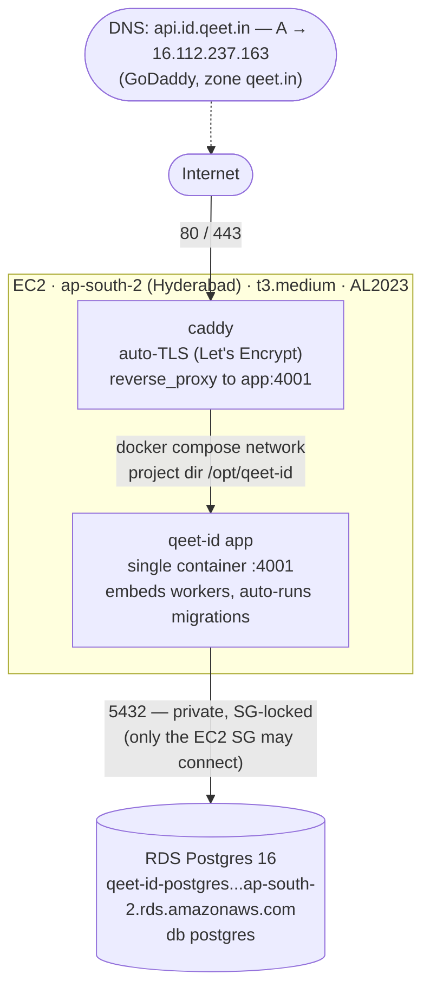

# Deploy — qeet-id API

Production runbook for the qeet-id backend. The API runs as a **single Docker
container** on one **EC2** host, behind **Caddy** (automatic HTTPS), with
**Postgres on RDS**. CI/CD builds the image, pushes it to **GHCR**, and deploys
over **SSH**. No Terraform, no Kubernetes.

One container is the whole backend: the server **embeds the background workers**
and **auto-applies DB migrations on startup**, so there's nothing else to run.



---

## 1. Live environment (current values)

| Thing | Value |
|---|---|
| **Public API** | `https://api.id.qeet.in` (OIDC issuer = `https://api.id.qeet.in`) |
| **Region** | `ap-south-2` (Hyderabad) |
| **EC2 instance** | `i-0a03cf55110abf290` · `t3.medium` · Amazon Linux 2023 (x86_64) |
| **Elastic IP** | `16.112.237.163` |
| **EC2 security group** | inbound 80, 443 from `0.0.0.0/0`; 22 from admin IP |
| **RDS** | `qeet-id-postgres` · Postgres 16 · `db.t4g.micro` · **not public** |
| **RDS endpoint** | `qeet-id-postgres.ctsgcomag80l.ap-south-2.rds.amazonaws.com:5432` |
| **DB / user** | database `postgres` (the RDS default — `qeet_id` was not created), master user `postgres` |
| **RDS security group** | `rds-ec2-2` (`sg-0a13954ccfb2f4b62`) — allows 5432 from the EC2 SG |
| **Image** | `ghcr.io/qeetgroup/qeet-id:latest` (+ `:<git-sha>` per build) |
| **Deploy branch** | `main` (push → auto-deploy) |
| **Host project dir** | `/opt/qeet-id` (compose, Caddyfile, `.env`, PEMs, `caddy_data/`) |
| **DNS** | GoDaddy, zone `qeet.in`, A record host `api.id` → EIP |
| **Frontends (separate deploys)** | `id.qeet.in` (marketing), `login.id.qeet.in` (hosted login), `console.id.qeet.in` (admin) |

> Secrets (DB password, JWT/SAML keys) are **never** in this repo — they live only
> on the host in `/opt/qeet-id/`. See §5.

---

## 2. How a deploy works

Pipeline: [`.github/workflows/deploy.yml`](../.github/workflows/deploy.yml). Triggered by **push to `main`** (or manual **Run workflow**). Steps, in order:

1. **Checkout**.
2. **Log in to GHCR** — `docker/login-action` with the auto `GITHUB_TOKEN`.
3. **Build & push image** — `docker build` from the repo-root [`Dockerfile`](../Dockerfile) (server only), pushes `:latest` + `:<sha>` to GHCR.
4. **Copy compose files to host** — `scp` of `deploy/docker-compose.yml` + `deploy/Caddyfile` → `/opt/qeet-id/`.
5. **Deploy over SSH** — on the host:
   ```
   docker login ghcr.io           # using the workflow's GITHUB_TOKEN
   export IMAGE=ghcr.io/qeetgroup/qeet-id:<sha>   # pins this exact build
   export JWT_SIGNING_KEY="$(cat jwt_signing_key.pem)"
   export SAML_IDP_KEY="$(cat saml_idp_key.pem)"
   export SAML_IDP_CERT="$(cat saml_idp_cert.pem)"
   docker compose pull
   docker compose up -d --remove-orphans
   # waits up to 60s for http://127.0.0.1:4001/readyz, else fails the job + dumps app logs
   docker image prune -f
   ```

**Why the `export` lines:** `JWT_SIGNING_KEY`, `SAML_IDP_KEY`, `SAML_IDP_CERT` are
**multi-line PEMs**. Docker `env_file` can't store newlines, so they're kept as
files on the host and injected into the container via `${VAR}` interpolation in
[`docker-compose.yml`](docker-compose.yml). Everything else comes from `.env`.

**GH repo secrets used:** `EC2_HOST` (`16.112.237.163`), `EC2_USER` (`ec2-user`),
`EC2_SSH_KEY` (the instance's private key PEM). GHCR auth uses the built-in
`GITHUB_TOKEN` — nothing to create.

---

## 3. Deploying & verifying

**Normal deploy:** merge/push to `main`. Watch **GitHub → Actions → Deploy**.
**Manual deploy:** Actions → **Deploy** → **Run workflow** → branch `main`.

A green run ends with `deployed ghcr.io/qeetgroup/qeet-id:<sha>`. Then verify:

```bash
curl -i https://api.id.qeet.in/readyz                    # 200 OK
curl -s https://api.id.qeet.in/.well-known/openid-configuration | grep issuer
#   → "issuer":"https://api.id.qeet.in"
curl -s https://api.id.qeet.in/.well-known/jwks.json     # JSON with keys
```

---

## 4. Files

```
deploy/
  docker-compose.yml   # app (GHCR image) + caddy; reads .env, injects PEMs from shell
  Caddyfile            # {$SITE_ADDRESS} → reverse_proxy app:4001, auto-TLS
  .env.example         # template for the host-only /opt/qeet-id/.env
  README.md            # this runbook
.github/workflows/deploy.yml   # build → push GHCR → scp → ssh compose up
```

---

## 5. Configuration & secrets (host: `/opt/qeet-id`)

| File | Contents | Committed? |
|---|---|---|
| `.env` | `DB_URL`, `JWT_SECRET`, `SECRETS_KEY`, + all non-secret config | ❌ host-only |
| `jwt_signing_key.pem` | EC P-256 private key (ES256 token signing) | ❌ host-only |
| `saml_idp_key.pem` | RSA private key (SAML IdP) | ❌ host-only |
| `saml_idp_cert.pem` | self-signed X.509 cert (SAML IdP) | ❌ host-only |
| `docker-compose.yml`, `Caddyfile` | overwritten by each deploy (`scp`) | ✅ from repo |

`DB_URL` format (password lives only in this file):
```
DB_URL=postgres://postgres:<DB_PASSWORD>@qeet-id-postgres.ctsgcomag80l.ap-south-2.rds.amazonaws.com:5432/postgres?sslmode=require
```

**Generate / rotate secrets:**
```bash
openssl rand -hex 32                                   # JWT_SECRET
openssl rand -base64 32                                # SECRETS_KEY  (base64 AES-256)
openssl ecparam -name prime256v1 -genkey -noout > jwt_signing_key.pem      # JWT signing key
openssl req -x509 -newkey rsa:2048 -keyout saml_idp_key.pem \
  -out saml_idp_cert.pem -days 3650 -nodes -subj "/CN=Qeet ID SAML IdP"    # SAML key+cert
```
After changing any secret/`.env` value, re-apply (see §6).

---

## 6. Routine operations (run on the host)

```bash
ssh -i qeet-id-server-connect.pem ec2-user@16.112.237.163
cd /opt/qeet-id

docker compose ps                       # container status
docker compose logs -f app              # live app logs (Ctrl-C to stop)
docker compose logs --tail=100 caddy    # TLS / proxy logs
curl -fsS http://127.0.0.1:4001/readyz  # app health from the box itself
```

**Apply an `.env` change / restart with PEMs loaded:**
```bash
cd /opt/qeet-id
export JWT_SIGNING_KEY="$(cat jwt_signing_key.pem)"
export SAML_IDP_KEY="$(cat saml_idp_key.pem)"
export SAML_IDP_CERT="$(cat saml_idp_cert.pem)"
docker compose up -d --force-recreate
```

**Rollback to a previous image** (no rebuild):
```bash
cd /opt/qeet-id
export JWT_SIGNING_KEY="$(cat jwt_signing_key.pem)"
export SAML_IDP_KEY="$(cat saml_idp_key.pem)"; export SAML_IDP_CERT="$(cat saml_idp_cert.pem)"
IMAGE=ghcr.io/qeetgroup/qeet-id:<older-sha> docker compose up -d
```
…or re-run the **Deploy** workflow from the older commit in the Actions UI.

**Connect to the database** (debugging):
```bash
sudo dnf install -y postgresql15    # one-time: psql client
psql "$(grep '^DB_URL=' /opt/qeet-id/.env | cut -d= -f2-)"
```

**Migrations** run automatically on every app start (embedded in the binary,
guarded by a Postgres advisory lock — safe to re-run). There is no separate
migrate step. Keep schema changes backward-compatible across a deploy.

---

## 7. Where to debug when it fails

**First question: did the _GitHub Action_ fail, or is the _app_ unhealthy?**
Open **GitHub → Actions → Deploy → the run** and find the red step.

### A. The pipeline step that failed

| Failing step | Likely cause | Fix |
|---|---|---|
| **Build & push image** | Go build / Dockerfile error | Read the build log; reproduce locally: `docker build -f Dockerfile .` from repo root |
| **Build & push image** (push) | missing `packages: write` perm | it's set in the workflow; check org package policy |
| **Copy compose files to host** (scp) | SSH can't connect | verify `EC2_HOST`/`EC2_USER`/`EC2_SSH_KEY` secrets; instance running; SG allows 22 from GitHub runners (or use a self-hosted/SSM path); `/opt/qeet-id` exists + owned by `ec2-user` |
| **Deploy over SSH** → `docker login ghcr.io … denied` | host can't pull private image | make the GHCR package **Internal**, or add a `read:packages` PAT secret and use it for the host login |
| **Deploy over SSH** → `cat: jwt_signing_key.pem: No such file` | PEM files missing on host | regenerate them in `/opt/qeet-id` (see §5) |
| **Deploy over SSH** → `app did not become ready` | **app is crash-looping** → go to section B | — |

### B. App crash-loop (`app did not become ready`, container restarting)

Read the app logs — the failing run prints the last 80 lines, or on the host:
```bash
docker compose logs --tail=120 app
```
Match the error:

| Log line | Cause | Fix |
|---|---|---|
| `SAML_IDP_KEY and SAML_IDP_CERT are required outside dev` | SAML PEMs missing/empty | generate `saml_idp_key.pem` + `saml_idp_cert.pem` (§5), redeploy |
| `JWT_SIGNING_KEY is required outside dev` | signing key missing/empty | generate `jwt_signing_key.pem` (§5), redeploy |
| `JWT_SECRET is missing, shorter than 32 chars, or a known placeholder` | weak/placeholder `JWT_SECRET` | set `JWT_SECRET=$(openssl rand -hex 32)` in `.env` |
| `SECRETS_KEY is required …` | missing vault key | set `SECRETS_KEY=$(openssl rand -base64 32)` in `.env` |
| `connect db … connection refused` / `timeout` | RDS unreachable | RDS SG `rds-ec2-2` must allow 5432 from the EC2 SG; RDS not public; same VPC |
| `database "<name>" does not exist` | the DB named in `DB_URL` doesn't exist on RDS | point `DB_URL` at an existing DB (we use the default `postgres`), or create one: `psql ".../postgres" -c 'CREATE DATABASE <name>;'` |
| `password authentication failed` | wrong creds in `DB_URL` | fix user/password in `/opt/qeet-id/.env` |
| `ALLOWED_ORIGINS must list explicit origins` / `APP_BASE_URL must be a real public origin` | prod safety check | set real `https://…` values in `.env` (never `*`, never localhost) |

> These prod-safety checks are enforced because `SERVICE_ENV=production`. They live
> in [`cmd/server/main.go`](../cmd/server/main.go) (`JWT_SIGNING_KEY` ~L255,
> `SAML_IDP_KEY`/`SAML_IDP_CERT` ~L386) and `platform/config/config.go`
> `Validate()`. **Never "fix" them by setting `SERVICE_ENV=dev`** — that disables
> CSRF and auth safety in production.

### C. TLS / certificate problems (site unreachable, cert errors)

```bash
docker compose logs --tail=120 caddy     # cert issuance details
dig +short api.id.qeet.in @8.8.8.8        # must return 16.112.237.163
```
| Symptom | Cause | Fix |
|---|---|---|
| Caddy can't get a cert | DNS not pointing at the EIP | fix the GoDaddy A record (`api.id` → `16.112.237.163`); wait for propagation |
| ACME challenge fails | port 80/443 closed | EC2 SG must allow 80 + 443 from `0.0.0.0/0` |
| `CAA` rejection in logs | `qeet.in` CAA blocks Let's Encrypt | add a CAA permitting `letsencrypt.org`, or remove the CAA |
| Want HTTP first (pre-DNS) | — | set `SITE_ADDRESS=:80` in `.env`, redeploy; switch back to `api.id.qeet.in` after DNS resolves |

### D. Quick triage cheatsheet
```bash
docker compose ps                         # are app + caddy "Up"? is app restarting?
docker compose logs --tail=120 app        # app errors (config, DB, migrations)
docker compose logs --tail=120 caddy      # TLS / proxy errors
curl -fsS http://127.0.0.1:4001/readyz    # app healthy locally? (bypasses Caddy/DNS)
curl -i https://api.id.qeet.in/readyz     # healthy through Caddy + TLS?
systemctl status docker                    # is Docker itself running?
df -h; free -m                             # disk full / OOM?
```
**Mental model:** `curl localhost:4001/readyz` works but `https://api.id.qeet.in`
doesn't ⇒ problem is **Caddy/DNS/TLS** (section C). `localhost:4001/readyz` fails
⇒ problem is the **app** (section B).

---

## 8. Rebuild the host from scratch (disaster recovery)

If the EC2 box is lost, the data is safe in RDS. To rebuild:

1. Launch a new **Amazon Linux 2023** `t3.medium` in `ap-south-2`, same VPC, with
   an SG allowing 80/443 (+22 from your IP). Associate the Elastic IP
   `16.112.237.163` (so DNS still resolves).
2. Ensure the RDS SG `rds-ec2-2` allows 5432 from the new instance's SG.
3. Install Docker + Compose plugin:
   ```bash
   sudo dnf update -y && sudo dnf install -y docker
   sudo systemctl enable --now docker
   sudo usermod -aG docker ec2-user        # re-login after this
   sudo mkdir -p /usr/local/lib/docker/cli-plugins
   sudo curl -fsSL "https://github.com/docker/compose/releases/download/v2.29.7/docker-compose-linux-x86_64" \
     -o /usr/local/lib/docker/cli-plugins/docker-compose
   sudo chmod +x /usr/local/lib/docker/cli-plugins/docker-compose
   ```
4. Recreate `/opt/qeet-id` + secrets:
   ```bash
   sudo mkdir -p /opt/qeet-id && sudo chown ec2-user:ec2-user /opt/qeet-id
   cd /opt/qeet-id
   cp /path/to/deploy/.env.example .env && nano .env     # set DB_URL (existing RDS), JWT_SECRET, SECRETS_KEY
   # then generate the 3 PEMs from §5
   chmod 600 .env *.pem
   ```
5. Update the `EC2_HOST` GitHub secret if the IP changed (it won't, if you reused
   the EIP), then run the **Deploy** workflow.

---

## 9. Open hardening items

- **Email is log-only** — `SMTP_*` unset, so reset/verify/invite emails only log.
  Wire Amazon SES (set `SMTP_HOST/USERNAME/PASSWORD` in `.env`) before relying on them.
- **SSH (22) open to `0.0.0.0/0`** — scope to your IP, or move deploys to SSM.
- **Single instance** — `REDIS_URL` blank, in-process rate limits (correct for one
  box). Add ElastiCache + set `REDIS_URL` only if you run >1 app instance.
- **RDS backups** — default 7-day retention; enable PITR / longer retention for prod.
- **`SECRETS_PROVIDER=static`** — uses `SECRETS_KEY`. Optionally move to
  `aws-kms` (`KMS_KEY_ID` + `SECRETS_WRAPPED_DEK`) later.
