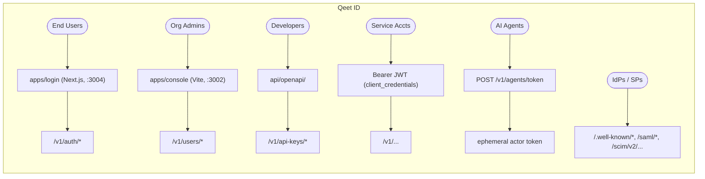
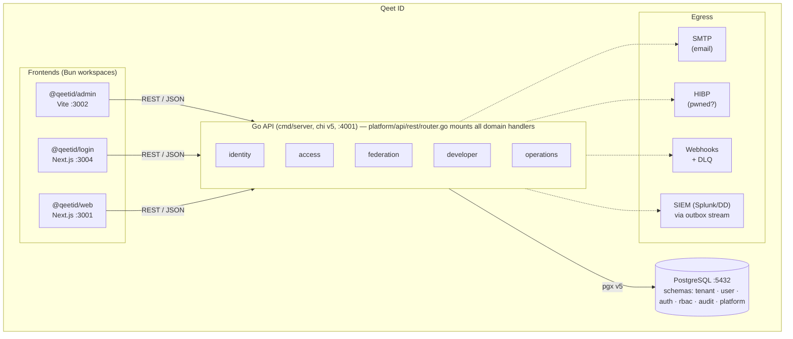

# System Overview

Qeet ID is a passkeys-first, multi-tenant identity platform — a self-hostable alternative to Auth0 and Okta. It provides authentication, authorization, federation, and developer-access primitives for SaaS products built on the `qeet.in` domain.

## What it is

| Capability | Examples |
|---|---|
| Authentication | Password, passkeys (WebAuthn/FIDO2), TOTP, magic-link, social OAuth |
| Authorization | RBAC (roles + permissions), ReBAC (Zanzibar-style relation tuples) |
| Federation | OIDC provider, SAML 2.0 IdP/SP, SCIM 2.0 provisioning, LDAP bind |
| Developer access | API keys, service accounts, auth hooks, webhooks, AI-agent identities |
| Compliance | Tamper-evident audit log, GDPR subject access/deletion, verifiable credentials |

## Actors

## Component map

## Five bounded contexts

| Context | Package root | Purpose |
|---|---|---|
| **identity** | `domains/identity/` | User accounts, organizations (tenants), groups, invitations, domain verification |
| **access** | `domains/access/` | Authentication, RBAC/ReBAC, MFA, passkeys, recovery, threat detection, bot detection |
| **federation** | `domains/federation/` | OIDC provider, SAML 2.0, SCIM 2.0, LDAP, social OAuth |
| **developer** | `domains/developer/` | API keys, service accounts, auth hooks, webhooks, AI agents, verifiable credentials |
| **operations** | `domains/operations/` | Audit log, SIEM, billing, GDPR, analytics, notifications, email templates |

Each context owns its own PostgreSQL schema. Cross-context calls go through small interfaces declared by the consumer — never by importing a concrete service from another context.

## Non-goals

- Qeet ID is **not** a general-purpose app framework. It manages identity and access; application business logic lives in the products that integrate with it.
- It does **not** store application data — only identity, session, and authorization state.
- It does **not** replace Qeet Notify, Qeet Pay, or Qeet People; it provides identity primitives those products consume.

## Key URLs (development)

| Service | URL |
|---|---|
| API | `http://localhost:4001` |
| Admin console | `http://localhost:3002` |
| Login app | `http://localhost:3004` |
| Website | `http://localhost:3001` |
| OpenAPI specs | `api/openapi/` (5 bounded-context files) |
| Postman collection | `api/postman/qeet-id.postman_collection.json` |

## Production domain

All apps run under `id.qeet.in` subdomains per the [Qeet Group domain architecture](../../../qeet-files/DOMAIN-ARCHITECTURE.md).
