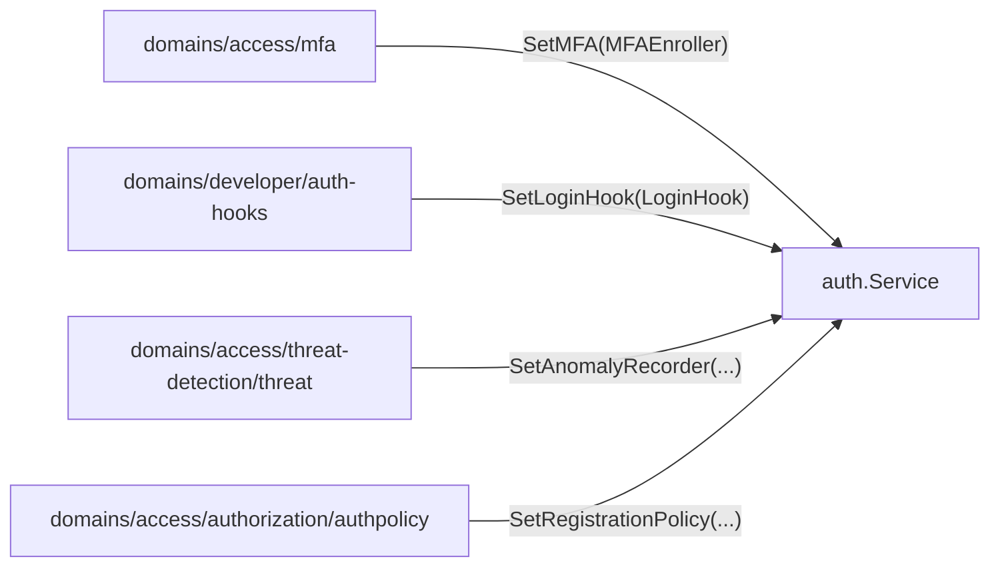
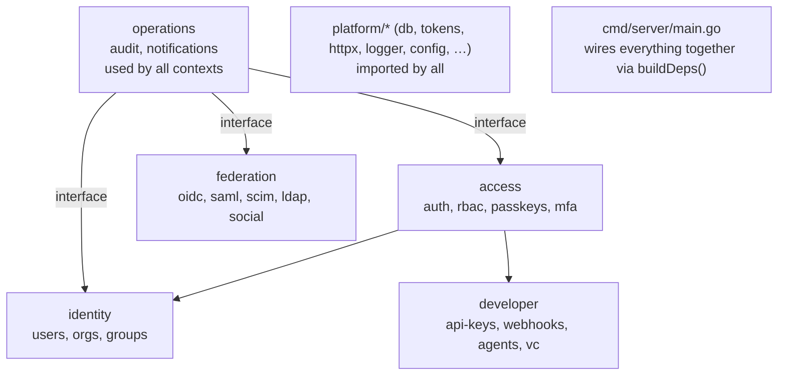

# Bounded Contexts

Qeet ID's backend is a **modular monolith** partitioned into five bounded contexts. Each context is a Go package subtree under `domains/<context>/`, owns its own PostgreSQL schema, and communicates with other contexts only through small interfaces (never by importing another context's concrete types).

## Enforced dependency rules

Architecture rules are verified automatically by [`tests/architecture/arch_test.go`](../../tests/architecture/arch_test.go). CI fails if they are violated:

- **R1** — `platform/*` must **not** import `domains/*` or `cmd/*`. The single exception is `platform/api/rest`, the composition root that mounts every domain handler (imported only by `cmd/server`).
- **R2** — `domains/*` must **not** import `cmd/*` or the `platform/api/rest` router. Importing `platform/api/rest/httpx` and other `platform/*` utilities is expected and fine.

Cross-domain calls (e.g., `authentication` calling `audit.Record()`) go through **interfaces declared by the caller**, not by importing the callee's concrete service.

```go
// Caller declares the interface it needs — inside domains/access/authentication/
type auditLogger interface {
    Record(ctx context.Context, e audit.Event) error
}
```

`cmd/server/main.go:buildDeps()` wires the concrete implementation at startup.

---

## Context: identity

**Package root:** `domains/identity/`  
**Schema:** `tenant`, `user`  
**Purpose:** Owns the core entities — who exists and where they belong.

| Subdomain | Package path | Responsibility |
|---|---|---|
| `users` | `domains/identity/users` | User lifecycle: create, update, suspend, avatar, listing |
| `organizations` | `domains/identity/organizations` | Tenant (workspace) CRUD, branding customization |
| `groups` | `domains/identity/groups` | User groups within a tenant, group-level RBAC |
| `invitations` | `domains/identity/invitations` | Invite flow: token generation, acceptance, email dispatch |
| `verification` | `domains/identity/verification` | Email and phone verification tokens |
| `domains` | `domains/identity/domains` | DNS domain ownership verification for tenants |

**External integrations:** SMTP (email dispatch via `platform/messaging/notifier`)

---

## Context: access

**Package root:** `domains/access/`  
**Schema:** `auth`, `rbac`  
**Purpose:** All security decisions — who is authenticated and what they can do.

| Subdomain | Package path | Responsibility |
|---|---|---|
| `authentication` | `domains/access/authentication` | Login, signup, credential verification, lockout, trusted devices |
| `authorization/rbac` | `domains/access/authorization/rbac` | Roles, permissions, assignments; `rbac.Enforce` middleware |
| `authorization/rebac` | `domains/access/authorization/rebac` | Zanzibar-style relation tuples; recursive `Check()` with cycle guard |
| `authorization/policy` | `domains/access/authorization/policy` | Generic authorization policy rules |
| `authorization/authpolicy` | `domains/access/authorization/authpolicy` | Per-tenant auth settings (self-reg, password rules, HIBP toggle) |
| `mfa` | `domains/access/mfa` | TOTP enrollment, verification, recovery codes |
| `passkeys` | `domains/access/passkeys` | WebAuthn/FIDO2 registration and authentication ceremonies |
| `recovery` | `domains/access/recovery` | Forgot-password, magic-link, OTP reset flows |
| `risk/ipallow` | `domains/access/risk/ipallow` | IP allow/deny list rules per tenant |
| `threat-detection/threat` | `domains/access/threat-detection/threat` | Brute-force / credential-stuffing anomaly recording |
| `threat-detection/bot` | `domains/access/threat-detection/bot` | Bot scoring signals |

**Key design:** `authentication.Service` uses injected interfaces for MFA gating, login hooks, and anomaly recording — enabling the access context to call into other contexts without circular imports.



---

## Context: federation

**Package root:** `domains/federation/`  
**Schema:** `auth` (shared, owns OIDC/SAML/SCIM tables)  
**Purpose:** Makes Qeet ID an identity provider for external apps, and a consumer of external IdPs.

| Subdomain | Package path | Responsibility |
|---|---|---|
| `oidc` | `domains/federation/oidc` | OIDC provider: clients, authorization code flow, JWKS, userinfo |
| `saml` | `domains/federation/saml` | SAML 2.0 IdP: assertions, ACS, SP metadata, multi-connection |
| `scim` | `domains/federation/scim` | SCIM 2.0 inbound provisioning (users + groups) from enterprise IdPs |
| `ldap` | `domains/federation/ldap` | LDAP directory bind authentication |
| `social` | `domains/federation/social` | OAuth 2.0 social login (Google, GitHub, etc.) — start/callback/provision |

**Protocol paths (no `/v1` prefix):**
- OIDC: `/.well-known/openid-configuration`, `/jwks.json`, `/userinfo`
- SAML: `/saml/*`, `/metadata.xml`, ACS endpoint
- SCIM: `/scim/v2/*` (per-tenant bearer token)

---

## Context: developer

**Package root:** `domains/developer/`  
**Schema:** `platform` (API keys, agents, webhooks, credentials)  
**Purpose:** Machine-facing access, automation, and extensibility primitives.

| Subdomain | Package path | Responsibility |
|---|---|---|
| `api-keys` | `domains/developer/api-keys` | API key CRUD, key prefix `qk_`, hashed storage, middleware auth |
| `service-accounts` | `domains/developer/service-accounts` | Machine principals for `client_credentials` JWT grant |
| `auth-hooks` | `domains/developer/auth-hooks` | Synchronous post-auth hooks (signed webhook, fail-open/closed gate) |
| `webhooks` | `domains/developer/webhooks` | Async event delivery with DLQ; outbox-backed dispatcher |
| `agents` | `domains/developer/agents` | AI-agent identity definitions, secret `agt_` prefix, ephemeral token mint |
| `credentials/secrets` | `domains/developer/credentials/secrets` | Encrypted secrets vault (AES-GCM per-tenant, AWS KMS optional) |
| `credentials/vc` | `domains/developer/credentials/vc` | W3C JWT-VC issuance, verification, revocation registry |

---

## Context: operations

**Package root:** `domains/operations/`  
**Schema:** `audit`, `platform`  
**Purpose:** Observability, compliance, monetization, and tenant communication.

| Subdomain | Package path | Responsibility |
|---|---|---|
| `audit` | `domains/operations/audit` | Hash-chained, append-only audit log (SHA-256 per tenant) |
| `siem` | `domains/operations/siem` | Log streaming to Splunk HEC, Datadog, generic HTTP sinks |
| `analytics` | `domains/operations/analytics` | Audit query API and usage dashboards |
| `notifications` | `domains/operations/notifications` | In-app inbox for security alerts (principal-scoped) |
| `email-templates` | `domains/operations/email-templates` | Per-tenant transactional email template customization |
| `compliance` | `domains/operations/compliance` | GDPR subject access request, right to erasure |
| `retention` | `domains/operations/retention` | Auto-purge of soft-deleted users after configurable period |
| `billing` | `domains/operations/billing` | Plans, subscriptions, invoices; Stripe + Razorpay card payment routing |

---

## Dependency topology



All arrows represent interface-mediated calls (not package imports of concrete types across context boundaries).
