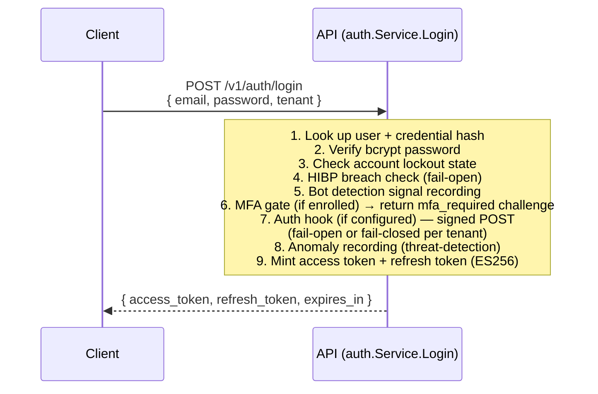
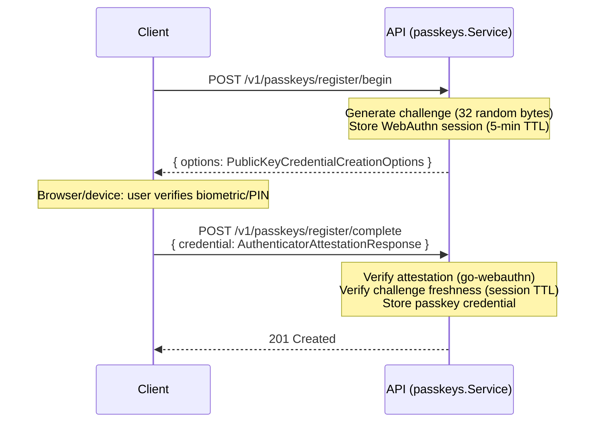
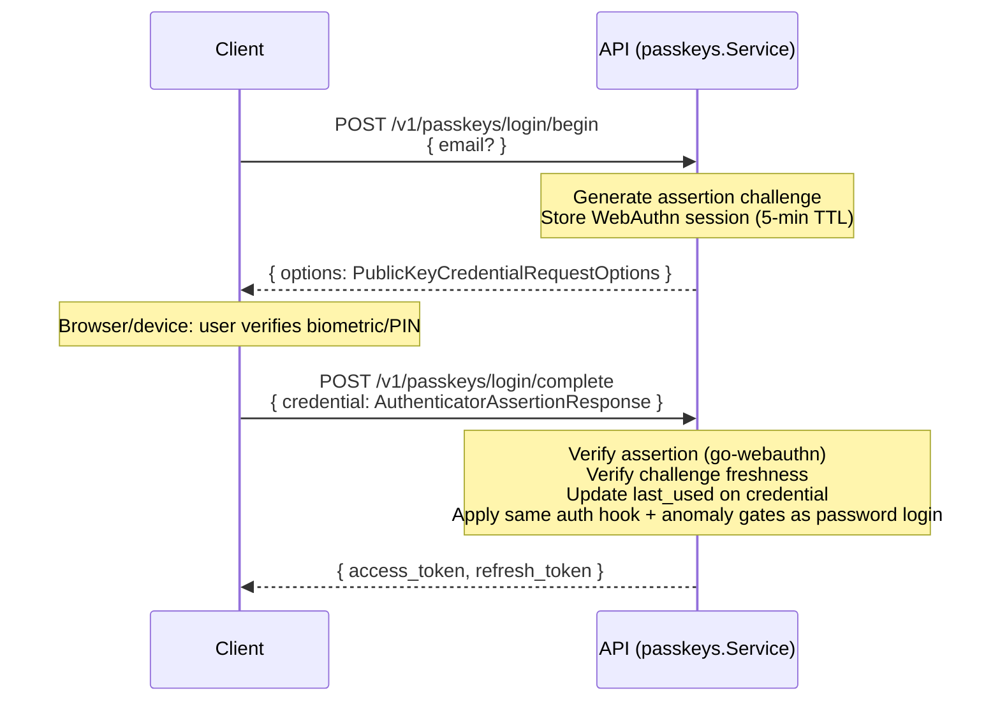
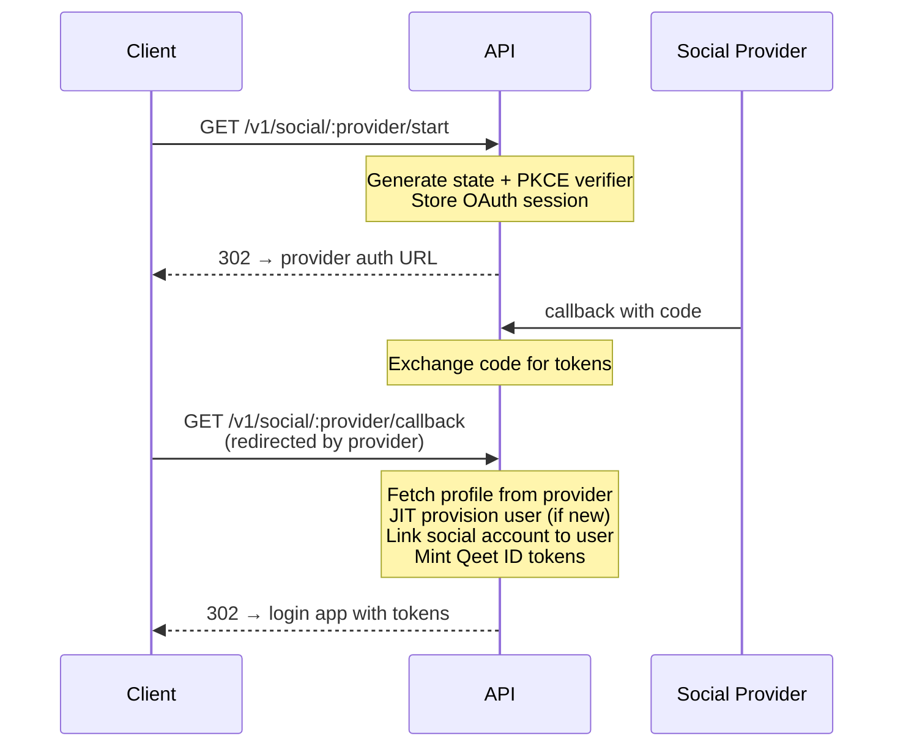
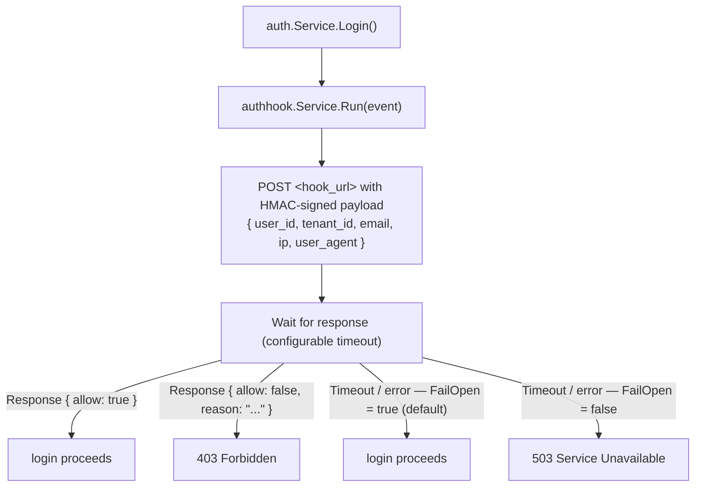

# Authentication Flows

All authentication flows are implemented in `domains/access/authentication` (`package auth`) and mounted at `/v1/auth/*` and `/v1/passkeys/*`. The hosted login app at `apps/login/` drives the browser-side UX.

## Email + password login



**Lockout:** After N consecutive failures (configurable per tenant, `migrations/0041_login_lockout`), the account enters a temporary lockout. Correct credentials during lockout still fail with `locked` error code.

**MFA challenge:** When `mfa_required` is returned, the client submits the TOTP code via `POST /v1/auth/mfa/verify` to complete the login and receive tokens.

## Token refresh

```
POST /v1/auth/refresh
{ refresh_token }
  → verify refresh token (not expired, not revoked)
  → mint new access token
  → optionally rotate refresh token
  → { access_token, refresh_token }
```

Access tokens are short-lived (default 15m). Refresh tokens are long-lived (default 30d) and single-use on rotation.

## Workspace switching

A user can belong to multiple tenants. Switching mints a fresh tenant-scoped token:

```
POST /v1/auth/switch-tenant
Authorization: Bearer <current_access_token>
{ tenant_id }
  → verify user is a member of target tenant
  → mint new access token scoped to target tenant
  → { access_token, refresh_token }
```

## Passkey (WebAuthn/FIDO2) flows

Passkeys are hardware-bound, phish-resistant credentials. Two ceremonies: registration and authentication.

### Registration (new passkey)



### Authentication (passkey login)



The 5-minute session TTL on WebAuthn challenges defends against replay attacks.

## Social OAuth



Supported providers: Google, GitHub, and any OAuth 2.0-compatible provider. Provider credentials stored in `auth.social_providers` per tenant.

## Magic-link / OTP recovery

```
POST /v1/recovery/forgot-password
{ email }
  → Generate short-lived OTP (6 digits) or magic-link token
  → Send via SMTP (platform/messaging/notifier)
  → 202 Accepted (always — no user enumeration)

POST /v1/recovery/reset
{ token, new_password }
  → Verify token (not expired, not used)
  → Hash new password (bcrypt)
  → Invalidate all existing sessions
  → 200 OK
```

In development, OTP codes and magic-link tokens are printed to the backend log (no SMTP required).

## Auth hooks

Auth hooks are synchronous, tenant-configured webhooks that gate login completion. After credential verification and MFA, the hook is called before tokens are minted:



Auth hooks are configured in the admin console under Developer → Auth Hooks.

## Bot detection

Bot scoring signals are recorded during login attempts. The `threat-detection/bot` domain analyzes request characteristics (rate patterns, user-agent entropy, IP reputation). High-confidence bot signals can trigger CAPTCHA challenges or temporary IP blocks.

## Signup flow

```
POST /v1/auth/signup
{ email, password, display_name }
  → Check self-registration policy (tenant may disable signup)
  → HIBP breach check on password (fail-open)
  → Hash password (bcrypt)
  → Create user (tenant-less initially)
  → Send verification email
  → 201 Created { user_id }
```

After signup, the user has no tenant. The first action is typically creating a workspace (`POST /v1/organizations`) which makes them the owner of a new tenant. The Admin console guides users through this on first login.
