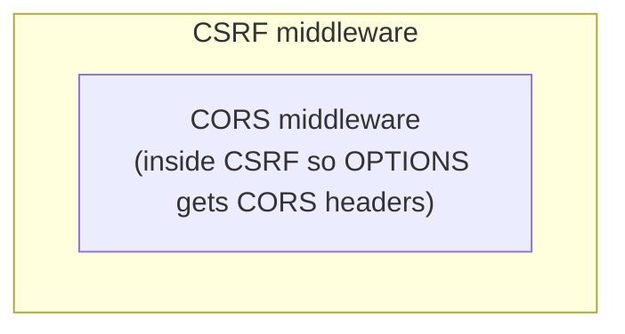

# CSRF and CORS

## CSRF protection

Cross-Site Request Forgery (CSRF) protection applies to all browser-cookie-authenticated mutation requests (POST, PUT, PATCH, DELETE). Implementation: `platform/api/rest/httpx/csrf.go`.

### Mechanism: HMAC-keyed double-submit cookie

**Token issuance (on every GET request):**
1. Generate 32 cryptographically random bytes
2. Compute `HMAC-SHA256(key=CSRF_KEY, data=random_bytes)`
3. Set cookie: `qe_csrf = base64url(random_bytes + hmac)`, `SameSite=Strict`, `Secure`, `Path=/`, 12h TTL, `HttpOnly=false`

The cookie is `HttpOnly=false` so JavaScript can read it and echo it in request headers.

**Verification (on every mutation request):**
1. Read `qe_csrf` cookie
2. Read `X-CSRF-Token` request header
3. Verify cookie == header value using `subtle.ConstantTimeCompare` (timing-safe)
4. Recompute HMAC and verify the cookie was issued by this server

**Origin check:**
5. Read `Origin` header (fall back to `Referer` if `Origin` is absent)
6. Verify the origin is in the `ALLOWED_ORIGINS` allowlist

Both checks must pass. If either fails: `403 Forbidden`, `code: "forbidden"`.

### How clients use CSRF tokens

Browser apps (the admin console and login app) automatically handle CSRF:
1. On app load, the first GET request receives the `qe_csrf` cookie
2. The frontend reads the cookie with `document.cookie` or a cookie library
3. Every mutation request includes `X-CSRF-Token: <value>`

SDK and API clients that use Bearer tokens **do not need CSRF tokens** — Bearer-authenticated requests bypass CSRF entirely (machine-to-machine calls cannot be CSRF'd since there is no ambient cookie credential).

### Exempt paths

These paths are exempt from CSRF verification:

| Path | Reason |
|---|---|
| `POST /saml/:conn/acs` | SAML ACS receives cross-origin POST from IdP |
| `POST /v1/oauth/authorize` | OAuth flow starts cross-origin |
| `POST /v1/oauth/token` | OAuth token exchange; Bearer-authenticated |
| `POST /v1/oauth/revoke` | Token revocation; Bearer-authenticated |
| `POST /v1/auth/login` | Pre-auth; no session cookie yet |
| `POST /v1/auth/signup` | Pre-auth |
| `POST /v1/recovery/*` | Pre-auth |
| `POST /v1/billing/webhooks` | Signed webhook from payment provider |

Exemptions are defined as path prefixes in `csrf.go:exemptPaths`.

### CSRF key rotation

The `CSRF_KEY` can be rotated without immediate invalidation of existing cookies — the HMAC suffix in the cookie value ties it to the key that generated it. A rolling rotation approach:
1. Deploy new `CSRF_KEY`
2. Existing cookies (signed with old key) will fail verification
3. Users receive a new cookie on their next GET (automatic, transparent)
4. Maximum disruption: one failed mutation request per user per rotation (user retries and the new cookie is used)

---

## CORS

Cross-Origin Resource Sharing (CORS) is configured in `platform/api/rest/router.go`.

### Policy

- **Allowed origins:** Explicitly configured via `ALLOWED_ORIGINS` environment variable (comma-separated list)
- **Wildcard (`*`) blocked in production:** `Config.Validate()` rejects wildcard origins outside `SERVICE_ENV=dev`
- **Credentials:** `Access-Control-Allow-Credentials: true` (required for cookie-bearing requests from browser apps)
- **Allowed methods:** GET, POST, PUT, PATCH, DELETE, OPTIONS
- **Allowed headers:** `Authorization`, `Content-Type`, `X-API-Key`, `X-CSRF-Token`, `X-Request-ID`
- **Exposed headers:** `X-Request-ID`
- **Preflight cache:** `Access-Control-Max-Age: 300` (5 minutes)

### Placement in middleware chain

CORS middleware is applied **before CSRF** in the middleware chain. This ensures that preflight (OPTIONS) responses carry CORS headers even when the CSRF check would fail for a cross-origin mutation (OPTIONS requests are not mutations).

### Development

In `SERVICE_ENV=dev`, `ALLOWED_ORIGINS` can include `http://localhost:3001`, `http://localhost:3002`, `http://localhost:3004` to allow the frontend dev servers to call the API. These origins must not be deployed to production.
